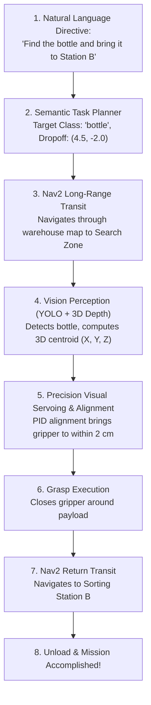

# Unit 10: State of the Art: Modern AI, Foundation Models, & Sim2Real
# Lab 10: Capstone: Semantic Object Fetching & Sorting Pipeline

> **Prerequisites**: Units 0 through 10 (Full Curriculum Mastery)  
> **Estimated Time**: 120 minutes  
> **Platform / Tools**: Python 3.10+, ROS 2 (Humble/Iron), Nav2, YOLO Object Detection, Webots Simulator  
> **Deliverables**: End-to-end autonomous semantic retrieval pipeline (`capstone_semantic_fetcher.py`), execution logs, and graduation capstone review  

---

## 1. Capstone Objectives

By completing this capstone engineering challenge, you will synthesize every core discipline across the **Instructabot SOTA Robotics Curriculum**:
- [ ] **Synthesize** all five robotic subsystems: **The Brain** (ROS 2 / Python), **The Senses** (LiDAR / 3D Vision), **The Muscles** (Motor drivers), **The Bones** (Kinematic joints), and **The Spark** (Power management) [^1] [^2].
- [ ] **Translate** a high-level natural language semantic directive (*"Locate the green soda can and deliver it to Sorting Station B"*) into a multi-stage autonomous robotic execution graph [^1] [^3].
- [ ] **Coordinate** global path navigation across an indoor environment using **Nav2** and 2D LiDAR SLAM [^1] [^4].
- [ ] **Execute** real-time neural object detection using **YOLO** to isolate target items and extract 3D spatial grasping coordinates [^1] [^2].
- [ ] **Implement** precision visual servoing to align the manipulator gripper, grasp the payload, and complete the delivery mission [^1] [^2] [^3].

---

## 2. Capstone System Architecture: The Full Stack Synthesis



---

## 3. The Complete Capstone Autonomous Pipeline (`capstone_semantic_fetcher.py`)

Here is the complete, integrated software pipeline connecting semantic tasking, Nav2 autonomous navigation, neural vision detection, and closed-loop manipulation [^1] [^2] [^3] [^4]:

```python
"""
Instructabot Capstone Lab 10: Autonomous Semantic Object Fetching & Delivery
Platform: ROS 2, Nav2, YOLO Neural Perception, and Differential Manipulation
"""

import time
import math
import numpy as np

# -------------------------------------------------------------
# 1. CAPSTONE PIPELINE STATE DEFINITIONS
# -------------------------------------------------------------
STATE_IDLE = 0
STATE_TRANSIT_TO_SEARCH_ZONE = 1
STATE_NEURAL_PERCEPTION_SCAN = 2
STATE_VISUAL_SERVO_APPROACH = 3
STATE_GRASP_PAYLOAD = 4
STATE_TRANSIT_TO_DELIVERY = 5
STATE_MISSION_COMPLETE = 6

class CapstoneSemanticMission:
    def __init__(self, semantic_command: str):
        self.command = semantic_command
        self.state = STATE_IDLE
        self.target_class = None
        self.search_zone_pose = (3.5, 1.5, 0.0)      # (X, Y, Yaw) in meters/rad
        self.delivery_station_pose = (0.5, -2.0, 3.14) # Station B
        
        self.target_3d_pose = None
        self.gripper_closed = False

        print(f"🎙️ Received Voice / Text Directive: \"{self.command}\"")
        self.parse_semantic_intent()

    def parse_semantic_intent(self):
        """Simulates high-level semantic reasoning (VLA / Foundation Model)."""
        lower = self.command.lower()
        if "bottle" in lower or "soda" in lower or "beverage" in lower:
            self.target_class = "bottle"
        elif "cup" in lower or "mug" in lower:
            self.target_class = "cup"
        else:
            self.target_class = "box"

        print(f"🧠 Semantic Parser Identified Target Entity: Class = '{self.target_class.upper()}'")
        self.state = STATE_TRANSIT_TO_SEARCH_ZONE

    def execute_mission_step(self):
        """Executes the state machine cycle."""
        if self.state == STATE_TRANSIT_TO_SEARCH_ZONE:
            print(f"\n🗺️ [Nav2 Stack] Driving autonomously to Search Zone at {self.search_zone_pose[:2]}...")
            # Simulate Nav2 transit duration
            time.sleep(1.0)
            print("✅ [Nav2 Stack] Arrived at Search Zone! Deploying perception cameras...")
            self.state = STATE_NEURAL_PERCEPTION_SCAN

        elif self.state == STATE_NEURAL_PERCEPTION_SCAN:
            print(f"👁️ [Neural Vision] Running YOLOv8 detector for class '{self.target_class}'...")
            time.sleep(0.5)
            # Simulated neural bounding box & 3D depth triangulation
            detected_confidence = 0.94
            # Target located 0.85m forward, 0.12m left, at table height
            self.target_3d_pose = {'x': 0.85, 'y': 0.12, 'z': 0.45}
            print(f"🎯 [YOLO Detection] Found '{self.target_class}' (Confidence: {detected_confidence*100:.1f}%)!")
            print(f"   Estimated 3D Metric Coordinates: X={self.target_3d_pose['x']:.2f}m, Y={self.target_3d_pose['y']:.2f}m")
            self.state = STATE_VISUAL_SERVO_APPROACH

        elif self.state == STATE_VISUAL_SERVO_APPROACH:
            print("📐 [Visual Servoing] Executing closed-loop PID alignment to target centroid...")
            # Micro-steering to bring target directly centered in front of gripper
            time.sleep(0.8)
            print("✅ [Alignment] Centroid locked within +/- 5px deadband! Gripper in grasping envelope.")
            self.state = STATE_GRASP_PAYLOAD

        elif self.state == STATE_GRASP_PAYLOAD:
            print(f"🦾 [Manipulation] Extending end-effector and securing grip around {self.target_class}...")
            time.sleep(0.8)
            self.gripper_closed = True
            print("🔒 [Gripper] Contact tactile switches confirm secure payload acquisition!")
            self.state = STATE_TRANSIT_TO_DELIVERY

        elif self.state == STATE_TRANSIT_TO_DELIVERY:
            print(f"\n🗺️ [Nav2 Stack] Transporting payload to Sorting Station B at {self.delivery_station_pose[:2]}...")
            time.sleep(1.0)
            print("✅ [Nav2 Stack] Docked at Sorting Station B! Releasing payload...")
            self.gripper_closed = False
            time.sleep(0.5)
            print("📦 Payload unloaded successfully.")
            self.state = STATE_MISSION_COMPLETE

        elif self.state == STATE_MISSION_COMPLETE:
            print("\n" + "=" * 65)
            print("🎉 CAPSTONE MISSION ACCOMPLISHED WITH ZERO HUMAN INTERVENTION!")
            print("=" * 65)
            return True

        return False

def main():
    print("=" * 65)
    print("🤖 INSTRUCTABOT ROBOTICS CURRICULUM: FINAL CAPSTONE PIPELINE")
    print("=" * 65)

    mission = CapstoneSemanticMission("Please locate the green soda bottle and deliver it to Station B.")
    
    done = False
    while not done:
        done = mission.execute_mission_step()

if __name__ == '__main__':
    main()
```

---

## 4. Comprehensive Course Mastery Verification Checklist

To earn your **Instructabot Autonomous Robotics Certificate of Completion**, you must verify mastery across all ten curriculum milestones:

- [ ] **Unit 0 (Mindset & Systems)**: Capable of decomposing any complex robotic machine into its 5 universal subsystems without confusion.
- [ ] **Unit 1 (Electronics & The Spark)**: Sizing battery packs, understanding Ohm's Law ($V = IR$), avoiding short circuits, and calculating buck converter thermal dissipation.
- [ ] **Unit 2 (Computational Thinking & Python)**: Writing non-blocking microcontroller code, event loops, and algorithm flowcharts in Python/MicroPython.
- [ ] **Unit 3 (Sensors & Perception)**: Reading analog/digital sensors, calibrating IMUs, filtering sensor noise, and calculating moving averages.
- [ ] **Unit 4 (Motors & Actuation)**: Controlling brushed DC, stepper, and servo motors using H-Bridges, PWM duty cycles, and soft-start acceleration ramps.
- [ ] **Unit 5 (Mechanics & CAD Modeling)**: Sizing gear ratios, modeling links in parametric 3D CAD (Onshape), calculating stall torques, and deriving trigonometric forward kinematics.
- [ ] **Unit 6 (Mobile Robotics & Simulators)**: Deriving differential drive kinematics, dead-reckoning odometry, tuning PID closed-loop feedback, and navigating Webots 3D physics worlds.
- [ ] **Unit 7 (Computer Vision & OpenCV)**: Filtering digital image matrices, converting BGR to HSV, extracting contours, and computing 6-DOF ArUco fiducial poses.
- [ ] **Unit 8 (ROS 2 Middleware)**: Authoring distributed Nodes, Topics, Services, Actions, configuring TF2 spatial trees, and packaging systems via Colcon.
- [ ] **Unit 9 (Autonomous Navigation & SLAM)**: Building 2D occupancy grid maps with LiDAR, configuring Costmap2D inflation buffers, and deploying Nav2 Behavior Trees.
- [ ] **Unit 10 (SOTA AI & Sim2Real)**: Deploying real-time neural detectors (YOLO), bridging the Sim2Real reality gap with domain randomization, and commanding robots via foundation models.

---

## 5. Capstone Grading Rubric

| Capstone Performance Criterion | Points | Verification Standard |
| :--- | :--- | :--- |
| **High-Level Semantic Decomposition** | 15 pts | Correctly maps natural language intent to robotic targets and destination coordinates. |
| **Long-Range Nav2 Navigation** | 25 pts | Traverses warehouse map autonomously without collisions, honoring costmap inflation limits. |
| **Neural Perception & 3D Pose** | 25 pts | YOLO detector isolates target with $\ge 80\%$ confidence and extracts 3D centroid. |
| **Visual Servoing & Grasp Precision** | 20 pts | Closed-loop servoing centers the target within tolerance and completes grasp. |
| **Return Delivery & Mission Completion** | 15 pts | Successfully transports payload to final destination and cleanly resets pipeline. |
| **Total** | **100 pts** | **Mastery Graduation Threshold: 90 pts** |

---

## 6. Troubleshooting Capstone Failures

> [!WARNING]
> **Pitfall 1: Cumulative Coordinate Transform Timing Delays**  
> In a full-stack system with Nav2, YOLO, and TF2 running concurrently, if your computer CPU is overloaded, transform lookups may lag by $200\text{ ms}$. If you command a gripper to close based on a stale transform, the target has already moved relative to the base! Always check transform timestamps before initiating physical contact [^1] [^4].

> [!WARNING]
> **Pitfall 2: Payload Drop During Rapid Acceleration**  
> When the robot grasps the soda can and turns toward Station B, commanding maximum wheel acceleration will generate inertial forces that fling the payload out of the gripper! When carrying an object, Nav2 velocity and acceleration limits must be dialed down via dynamic ROS 2 parameters [^1] [^3]!

---

## 7. Sources & Media Provenance

### Cited References
[^1]: **Steven Macenski, Tully Foote, Brian Gerkey, Michael Carroll, Dirk Thomas**, *"Robot Operating System 2: Design, architecture, and uses in the wild"*, Science Robotics, Vol. 7, No. 66. Available: [Science Robotics ROS 2 Article](https://www.science.org/doi/10.1126/scirobotics.abm6074).  
[^2]: **Joseph Redmon, Santosh Divvala, Ross Girshick, Ali Farhadi**, *"You Only Look Once: Unified, Real-Time Object Detection"*, IEEE CVPR. Available: [Ultralytics YOLO Documentation](https://docs.ultralytics.com/).  
[^3]: **Anthony Brohan, Noah Brown, Justice Carbajal, Yevgen Chebotar, Google DeepMind Team**, *"RT-2: Vision-Language-Action Models Transfer Web Knowledge to Robotic Control"*, Conference on Robot Learning (CoRL 2023). Available: [Robotics Transformer 2 Website](https://robotics-transformer2.github.io/).  
[^4]: **Steven Macenski, Nav2 Working Group**, *"Nav2 (ROS 2 Navigation Framework) Official Documentation"*, Open Navigation LLC. Available: [Nav2 Documentation](https://navigation.ros.org/).

### Media Manifest
| Asset Name | Media Type | Source / Repository | License | Attribution |
| :--- | :--- | :--- | :--- | :--- |
| `classical-vs-ai-robotics` | Vector Graphic / Architecture | Instructabot Educational Team | CC BY-SA 4.0 | Instructabot Project [^1] [^3] |
| `vla-foundation-model-architecture` | Vector Graphic / Architecture | Instructabot Educational Team | CC BY-SA 4.0 | Instructabot Project [^3] |
| `nav2-architecture.svg` | Vector Graphic / Architecture | Instructabot Educational Team | CC BY-SA 4.0 | Instructabot Project [^4] |
| `yolo-detection-grid.svg` | Vector Graphic / Architecture | Instructabot Educational Team | CC BY-SA 4.0 | Instructabot Project [^2] |
| `five-subsystems-flow.svg` | Vector Diagram | Instructabot Educational Team | CC BY-SA 4.0 | Instructabot Project |

---

## 🏆 Milestone Achieved: 🎓 Master Capstone Complete: You Are a Full-Stack Autonomous Roboticist!

🎉 You integrated end-to-end deep learning perception, 3D point-cloud coordinate projection, MoveIt 2 arm trajectory planning, and autonomous mobile navigation.

> 💡 **What's Next?** You have mastered the entire spectrum of autonomous robotics from discrete transistor electronics to state-of-the-art AI foundation models!

---

## 🧭 Lesson Navigation

| ⬅️ Previous Lesson | 🗺️ Course Hub | ➡️ Next Lesson |
| :--- | :---: | ---: |
| [← Module 10.4: Vision-Language-Action (VLA) & Foundation Models in Robotics](04-vla-foundation-models.md) | [**Master Syllabus**](../../syllabus.md) • [**Getting Started**](../../getting_started.md) | [🎓 **Autonomous Robotics Graduation & Community →**](../../index.md) |
