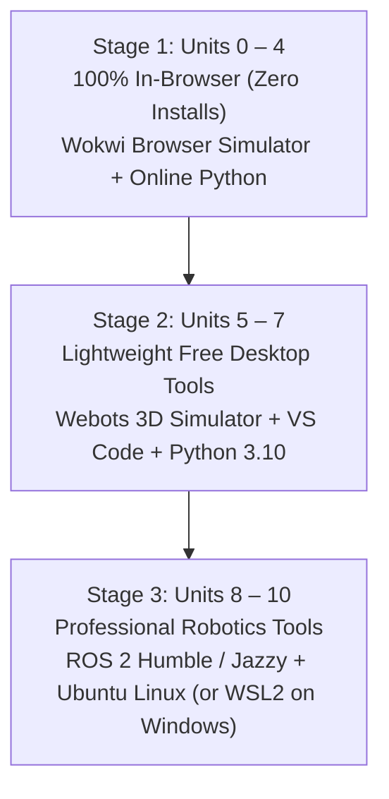

# 🚀 Getting Started with Instructabot

> **Welcome to Robotics!**  
> If you have never written a single line of code, never held a soldering iron, and never taken physics—**you are in the right place.**

---

## 🌟 The First-Day Guarantee
You will make a virtual electronic circuit work in your web browser **within 5 minutes of opening this page**, with **zero software to install**.

### ⚡ Live In-Browser Nightlight Simulator
Try it right now below—drag the slider to shine a flashlight on the sensor and watch the circuit react autonomously:

  

    

      <strong style="font-size: 15px; color: #f8fafc;">⚡ Autonomous Transistor Nightlight</strong>
      
Sense &rarr; Think &rarr; Act Circuit Loop

    

    
      🌙 Dark: LED ON
    
  

  <!-- SVG Circuit Diagram -->
  

    <svg viewBox="0 0 460 200" style="width: 100%; max-height: 190px;">
      <!-- Power Rails -->
      <line x1="30" y1="20" x2="430" y2="20" stroke="#ef4444" stroke-width="2.5"/>
      <text x="35" y="15" fill="#ef4444" font-size="11" font-weight="bold">+9V Rail</text>
      <line x1="30" y1="180" x2="430" y2="180" stroke="#3b82f6" stroke-width="2.5"/>
      <text x="35" y="195" fill="#60a5fa" font-size="11" font-weight="bold">Ground (0V)</text>

      <!-- Battery -->
      <rect x="35" y="65" width="22" height="42" rx="3" fill="#1e293b" stroke="#64748b" stroke-width="1.5"/>
      <text x="46" y="89" fill="#f8fafc" font-size="10" font-weight="bold" text-anchor="middle">9V</text>
      <line x1="46" y1="65" x2="46" y2="20" stroke="#ef4444" stroke-width="2"/>
      <line x1="46" y1="107" x2="46" y2="180" stroke="#3b82f6" stroke-width="2"/>

      <!-- LDR Photoresistor -->
      <circle cx="150" cy="55" r="16" fill="#1e293b" stroke="#f59e0b" stroke-width="2"/>
      <path d="M142 55 L146 51 L150 59 L154 51 L158 55" fill="none" stroke="#f59e0b" stroke-width="2"/>
      <text x="150" y="28" fill="#fbbf24" font-size="10" text-anchor="middle" font-weight="bold">LDR Sensor</text>
      <line x1="150" y1="39" x2="150" y2="20" stroke="#ef4444" stroke-width="2"/>
      <line x1="150" y1="71" x2="150" y2="100" stroke="#cbd5e1" stroke-width="2"/>

      <!-- 10k Resistor -->
      <rect x="142" y="125" width="16" height="26" rx="2" fill="#334155" stroke="#94a3b8" stroke-width="1.5"/>
      <text x="150" y="142" fill="#f8fafc" font-size="9" text-anchor="middle">10kΩ</text>
      <line x1="150" y1="100" x2="150" y2="125" stroke="#cbd5e1" stroke-width="2"/>
      <line x1="150" y1="151" x2="150" y2="180" stroke="#3b82f6" stroke-width="2"/>

      <!-- Junction to Base -->
      <circle cx="150" cy="100" r="4" fill="#fbbf24"/>
      <line x1="150" y1="100" x2="250" y2="100" stroke="#fbbf24" stroke-width="2"/>
      <text id="nl-vb-text" x="195" y="93" fill="#4ade80" font-size="10" font-weight="bold" text-anchor="middle">V_b = 0.72V</text>

      <!-- 2N2222 Transistor -->
      <line x1="250" y1="85" x2="250" y2="115" stroke="#f8fafc" stroke-width="3"/>
      <line x1="250" y1="92" x2="265" y2="78" stroke="#f8fafc" stroke-width="2"/>
      <line x1="265" y1="78" x2="265" y2="50" stroke="#f8fafc" stroke-width="2"/>
      <line x1="265" y1="50" x2="360" y2="50" stroke="#f8fafc" stroke-width="2"/>
      
      <line x1="250" y1="108" x2="265" y2="122" stroke="#f8fafc" stroke-width="2"/>
      <polygon points="262,118 266,122 267,117" fill="#f8fafc"/>
      <line x1="265" y1="122" x2="265" y2="180" stroke="#3b82f6" stroke-width="2"/>
      <text x="250" y="138" fill="#38bdf8" font-size="9" font-weight="bold" text-anchor="middle">2N2222 NPN</text>

      <!-- 330 Ohm Resistor -->
      <rect x="352" y="45" width="16" height="24" rx="2" fill="#334155" stroke="#94a3b8" stroke-width="1.5"/>
      <text x="360" y="61" fill="#f8fafc" font-size="9" text-anchor="middle">330Ω</text>
      <line x1="360" y1="20" x2="360" y2="45" stroke="#ef4444" stroke-width="2"/>
      <line x1="360" y1="69" x2="360" y2="90" stroke="#f8fafc" stroke-width="2"/>

      <!-- LED Symbol & Radiant Glow -->
      <circle id="nl-glow" cx="360" cy="100" r="32" fill="#facc15" opacity="0.45"/>
      <polygon id="nl-led" points="348,90 372,90 360,110" fill="#facc15" stroke="#eab308" stroke-width="1.5"/>
      <line x1="348" y1="110" x2="372" y2="110" stroke="#eab308" stroke-width="2"/>
      <text x="360" y="128" fill="#fef08a" font-size="10" font-weight="bold" text-anchor="middle">LED</text>
      <line x1="360" y1="110" x2="360" y2="140" stroke="#f8fafc" stroke-width="2"/>
      <line x1="360" y1="140" x2="265" y2="140" stroke="#f8fafc" stroke-width="2"/>
      <line x1="265" y1="140" x2="265" y2="78" stroke="#f8fafc" stroke-width="2"/>
    </svg>
  

  <!-- Multimeter Readouts -->
  

    

      
Ambient Light

      
20 Lux (Dark)

    

    

      
Base Voltage

      
0.72V (&ge;0.7V)

    

    

      
Transistor State

      
CLOSED (ON)

    

  

  <!-- Flashlight Slider Control -->
  

    

      🌙 Midnight Darkness
      &larr; Drag to shine flashlight &rarr;
      ☀️ Direct Sunlight
    

    <input id="nl-slider" type="range" min="0" max="100" value="15" style="width: 100%; accent-color: #f59e0b; cursor: pointer;">
  

  <!-- Pedagogical Explanation -->
  

    <strong>🌙 How Autonomy Works Here:</strong> In the dark, the photoresistor's resistance rises, raising the transistor Base voltage above <strong>0.7V</strong>. The transistor switch snaps shut, allowing power to flood into the nightlight LED!
  

### 🛠️ Next: Build the Full Physical Circuit in Simulation
Once you've explored the live simulation above, you can build the complete breadboard circuit with your own hands:
- **Zero-Code Breadboard Lab**: Follow the full step-by-step assembly guide in [Lab 1: The Zero-Code Light-Sensitive Nightlight](curriculum/unit-01-electronics/lab-01-zero-code-nightlight.md).
- **Interactive Simulator Options**:
  1. **Autodesk Tinkercad**: Build on a virtual breadboard using [Autodesk Tinkercad Circuits](https://www.tinkercad.com/circuits) (free, browser-based, recommended for analog circuits).
  2. **Wokwi**: In Unit 2, we introduce microcontrollers using Wokwi with pre-configured project files in [`simulations/wokwi/`](https://github.com/jscottvogel/Instructabot/tree/main/simulations/wokwi).

🎉 **Congratulations! You just analyzed your first autonomous sensor-actuator robotic circuit!**

---

## 🗺️ Choose Your Learning Track

Not everyone learns at the same pace or has the same goals. Choose the track that fits your schedule:

| Track | Who It's For | Weekly Commitment | Path Highlights |
| :--- | :--- | :--- | :--- |
| **🎒 High School / Explorer Track** | High school students, curious beginners, after-school robotics clubs. | 2–3 hours / week | Units 0 through 4 (Electronics, MicroPython, Sensors, Motors). Focus on hands-on Wokwi circuits and intuitive mechanical analogies. |
| **🎓 College / Engineering Track** | Undergraduate CS/ME/EE students, STEM majors, career transitioners. | 5–8 hours / week | Units 0 through 10 (Full Curriculum). Deep dive into C++/Python, kinematics, ROS 2 middleware, SLAM, and YOLO computer vision. |
| **🛠️ Weekend Maker Track** | Adults and hobbyists building practical physical projects. | 3–4 hours / week | Units 1, 2, 4, 6, 7. Focus on physical motor control, 3D printing/CAD, and OpenCV pan-tilt turrets. |

---

## 🖥️ Software Environment: Zero-Friction Progression

Instructabot is designed so you only install software **when you genuinely need it**:

1. **Units 0 – 4 (Foundations, Electronics, Brain, Senses, Motors)**:
   - Requires only a modern web browser (Chrome, Edge, Firefox, Safari).
   - All labs run in **Wokwi** and web Python. Works seamlessly on Chromebooks, MacBooks, and Windows laptops!
2. **Units 5 – 7 (Mechanics, Mobile Robotics, Computer Vision)**:
   - Install **[Webots Robot Simulator](https://cyberbotics.com)** (Free, open-source 3D physics simulator for Windows, Mac, and Linux).
   - Install **[Python 3.10+](https://www.python.org)** and **VS Code**.
3. **Units 8 – 10 (ROS 2, Autonomous SLAM, SOTA AI Foundation Models)**:
   - Run **ROS 2 Humble / Jazzy** natively on Ubuntu Linux, or inside **Windows Subsystem for Linux (WSL2)**, or using our pre-configured Docker container.

---

## 🛑 How to Get Unstuck: The "Three-Step Rule"

Whenever code throws an error or a circuit doesn't respond:
1. **Check the Common Pitfalls Section**: Every lesson includes a dedicated `[!WARNING]` troubleshooting guide addressing the most frequent beginner mistakes.
2. **Check the Plain-English Glossary**: If a technical term feels confusing, look it up in the [Robotics Glossary](glossary.md) for an everyday mechanical analogy.
3. **Consult the AI Editorial Board**: Run `python agent/reviewers/persona_tester.py` to evaluate your lab code against student friction metrics.
