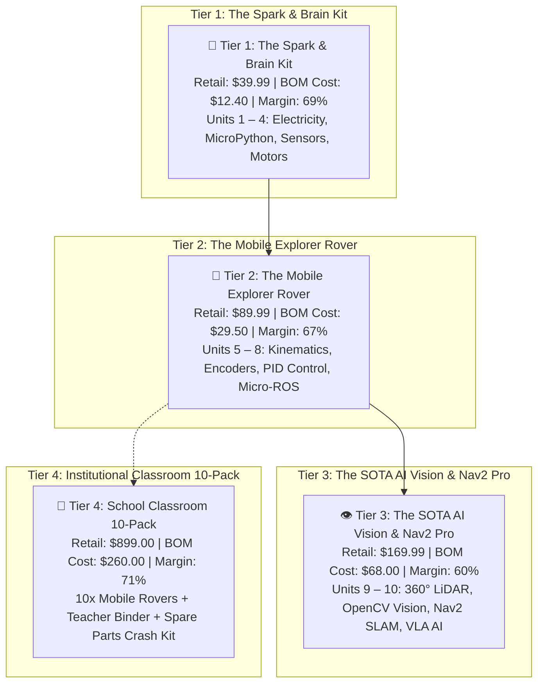
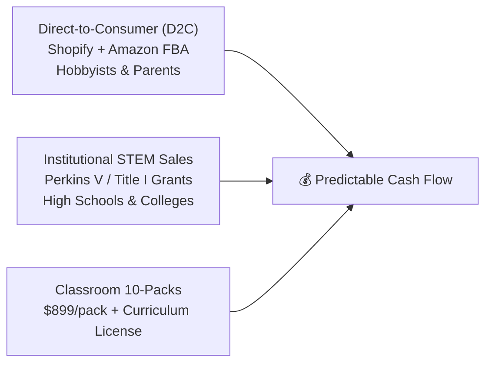

# 💼 Instructabot Hardware Kit Architecture & Monetization Blueprint

> **The Open-Core Hardware Business Model**  
> *"The curriculum is 100% free and open-source; the friction-free physical companion kits generate 65%+ gross margins."*

---

## 🌟 Executive Strategy & Market Opportunity

Traditional educational robotics kits suffer from two major flaws:
1. **Proprietary Walled Gardens (LEGO SPIKE, VEX Robotics)**: Cost \$400 – \$600 per student, lock schools into closed software, and teach cartoon block coding that fails to translate to real-world engineering careers.
2. **Cheap Uncurated Clones (Generic Amazon/AliExpress kits)**: Contain zero coherent curriculum, have broken or missing parts, suffer from outdated CD-ROM tutorials, and cause massive student frustration due to loose breadboard wires.

**Instructabot captures the massive middle ground**:
- A state-of-the-art curriculum teaching industry standards (**MicroPython, OpenCV, ROS 2, and AI**) available free to every student on Earth.
- High-quality, curated physical companion kits sold directly to parents, hobbyists, and high school STEM/CTE departments with **zero wiring guesswork**.

---

## 📦 The 3-Tier Hardware Kit Catalog

---

## 📋 Comprehensive Bill of Materials (BOM) & Unit Economics

### 🔹 Tier 1: The Spark & Brain Starter Kit (Units 1 – 4)
*Target Audience: Novices, Middle & High School STEM Classes, After-School Clubs.*  
*Retail Price: **\$39.99** | Wholesale Batch BOM (500 units): **\$12.40** | Gross Profit: **\$27.59 (69.0%)***

| Component | Part / Specification | Sourcing Channel | Wholesale Unit Cost |
| :--- | :--- | :--- | :--- |
| **Microcontroller** | Raspberry Pi Pico (RP2040) pre-soldered pin headers | LCSC / Raspberry Pi Direct | \$3.60 |
| **Breadboard & Jumper Pack** | 400-point transparent solderless breadboard + 65 flexible M-M wires | LCSC / Yancheng Elec | \$1.20 |
| **Sensors Pack** | HC-SR04 Ultrasonic Sonar, 5x LDR Photoresistors, TMP36 Temp | LCSC / Shenzhen | \$1.80 |
| **Actuators Pack** | SG90 Micro 9g Servo, DC Toy Motor with propeller blade | LCSC / TowerPro | \$1.60 |
| **Power & Semiconductors** | TB6612FNG Dual H-Bridge, 5x NPN Transistors, 20x Resistors, 10x LEDs | LCSC | \$1.40 |
| **Packaging & Insert** | Custom branded matte kraft box, QR Code Quickstart Card, foam tray | Local / Packlane | \$1.80 |
| **Total Tier 1 BOM Cost** | | | **\$12.40** |

---

### 🔹 Tier 2: The Mobile Explorer Autonomous Rover (Units 5 – 8)
*Target Audience: High School Robotics Teams (FRC/FTC), College Undergrads, Serious Makers.*  
*Retail Price: **\$89.99** | Wholesale Batch BOM (500 units): **\$29.50** | Gross Profit: **\$60.49 (67.2%)***

| Component | Part / Specification | Sourcing Channel | Wholesale Unit Cost |
| :--- | :--- | :--- | :--- |
| **Microcontroller** | ESP32-S3 Dual-Core Xtensa + Wi-Fi/BLE (Micro-ROS Compatible) | Espressif Direct / LCSC | \$4.20 |
| **Instructabot Custom Carrier** | Custom 2-layer PCB with keyed JST-XH connectors, reverse polarity fuse | JLCPCB SMT Assembly | \$2.80 |
| **Chassis & Hardware** | 3mm Matte Acrylic laser-cut chassis, brass standoffs, caster wheel | Factory Direct | \$3.50 |
| **Drive Motors & Wheels** | 2x Metal Gearmotors ($1:48$) with built-in magnetic Hall quadrature encoders | LCSC / Bringsmart | \$6.80 |
| **Motor Driver** | TB6612FNG Dual H-Bridge Motor Driver Module (1.2A continuous) | LCSC | \$1.10 |
| **Sensors** | HC-SR04 Ultrasonic Sensor on pan servo mount, 3-channel line tracker | LCSC | \$2.60 |
| **Battery Power Delivery** | 2x 18650 Li-ion battery sled with built-in BMS protection & USB-C charging | LCSC / Shenzhen | \$4.50 |
| **Packaging & Hardware Guide** | Branded rigid box, illustrated visual assembly poster, screwdriver set | Custom Packaging | \$4.00 |
| **Total Tier 2 BOM Cost** | | | **\$29.50** |

---

### 🔹 Tier 3: The SOTA AI Vision & Nav2 Pro Expansion (Units 9 – 10)
*Target Audience: University Robotics Labs, Engineering Capstone Students, Industry Pros.*  
*Retail Price: **\$169.99** | Wholesale Batch BOM (200 units): **\$68.00** | Gross Profit: **\$101.99 (60.0%)***

| Component | Part / Specification | Sourcing Channel | Wholesale Unit Cost |
| :--- | :--- | :--- | :--- |
| **360° Solid-State / dToF LiDAR** | LD19 / RPLIDAR C1 (12-meter range, 4500 samples/sec, ROS 2 driver) | LDROBOT Direct | \$42.00 |
| **Wide-Angle USB Camera** | 1080p 120° FOV low-distortion camera module with mount | Shenzhen Aoni | \$9.50 |
| **ArUco Calibration Target** | Matte anti-glare rigid aluminum composite fiducial calibration plate | Local Printing | \$2.50 |
| **SBC Mounting Bracket Pack** | Universal mounting kit for Raspberry Pi 4/5 / NVIDIA Jetson Orin Nano | Custom Laser-Cut | \$4.00 |
| **Capstone Manipulation Gripper** | 3D-printed/molded parallel 1-DOF gripper with micro-servo actuator | Factory Direct | \$5.00 |
| **Packaging & Pro Guide** | High-density foam anti-static flight case packaging + Nav2 quickstart | Custom Packaging | \$5.00 |
| **Total Tier 3 BOM Cost** | | | **\$68.00** |

---

## 🛡️ The "Instructabot Shield": Solving Beginner Hardware Friction

The single most frustrating failure in educational robotics is **fragile jumper wires pulling out of breadboards** or students plugging power in backwards, frying their \$5 microcontroller.

To solve this, our hardware kit introduces the **Instructabot Shield**:
- **Keyed JST-XH Connectors**: Motors and sensors click into keyed sockets that are physically impossible to plug in backwards.
- **Reverse-Polarity Diode & Resettable PTC Fuse**: If a student accidentally shorts power, the fuse trips harmlessly and resets when cooled—saving the microcontroller!
- **Onboard Power Switch & LED Indicators**: Clean power rail isolation between noisy high-current motors and delicate digital logic.
- **Standardized Form Factor**: Plugs directly onto a Raspberry Pi Pico or ESP32-S3.

---

## 📈 Revenue & Go-to-Market Projections

### Year 1 Conservative Financial Model:
- **Direct-to-Consumer (Amazon / Website)**:
  - 400x Tier 1 Spark Kits @ \$39.99 = **\$15,996** (Gross Profit: \$11,036)
  - 250x Tier 2 Rover Kits @ \$89.99 = **\$22,497** (Gross Profit: \$15,122)
  - 100x Tier 3 AI Pro Kits @ \$169.99 = **\$16,999** (Gross Profit: \$10,199)
- **Institutional / School Sales**:
  - 25x Classroom 10-Packs @ \$899.00 = **\$22,475** (Gross Profit: \$15,975)
- **Total Projected Year 1 Revenue**: **\$77,967**
- **Total Projected Year 1 Gross Profit**: **\$52,332 (67.1% Average Gross Margin)**

---

## 🚀 Execution Checklist to Launch Kits

1. [ ] **CAD & Carrier PCB Finalization**: Finalize the Instructabot Shield Gerber files in KiCad and order 5 prototype boards from JLCPCB (~$25 total).
2. [ ] **Pilot Classroom Beta (5–10 Kits)**: Partner with a local high school robotics teacher or STEM camp to run Units 1–4 using physical prototypes and record student friction.
3. [ ] **E-Commerce Storefront**: Launch a clean Shopify landing page integrated with Stripe, linking directly from the open-source GitHub textbook.
4. [ ] **Amazon FBA Ingestion**: Register Amazon Brand Registry for "Instructabot" to capture organic searches for "ROS 2 beginner robot kit" and "MicroPython robotics kit".
