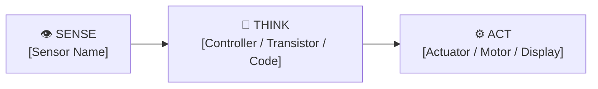

# 📓 Engineering Log: [Lab / Project Title]

**Author**: [Your Full Name]  
**Date**: [YYYY-MM-DD]  
**Collaborators / Teammates**: [Names or "Solo"]  
**Milestone / Unit**: [e.g., Unit 1 Capstone Lab]  
**Target Platform**: [Physical Breadboard / Wokwi Simulation / Webots 3D / ROS 2]  

---

## 1. Executive Objective & Sense-Think-Act Hypothesis

### Objective
[State in 2-3 sentences the engineering objective of this build. What physical or computational capability are you designing?]

### Sense-Think-Act Hypothesis
- **SENSE**: [What physical quantity is being transduced into electrical signals?]
- **THINK**: [What logic, mathematical formula, or solid-state threshold decides the system state?]
- **ACT**: [What physical actuator, motor, or indicator executes the mechanical response?]
- **Hypothesis**: [If condition X occurs, the system will execute response Y within tolerance Z.]

---

## 2. System Architecture & Schematic



> Attach an ASCII schematic, pinout diagram, or photograph/screenshot of your breadboard/simulation below:
> *(Optional: Save images in `notebooks/media/` and reference them here)*

---

## 3. Bill of Materials & Pin Configuration

| Component / Subsystem | Part Number / Specs | Quantity | Interface / GPIO Pin | Power Supply Rail |
| :--- | :--- | :--- | :--- | :--- |
| e.g. Microcontroller | Raspberry Pi Pico (RP2040) | 1 | USB / SWD | 3.3V Logic |
| e.g. Primary Sensor | [Sensor Model] | 1 | [Pin / Bus] | [VCC] |
| e.g. Primary Actuator | [Actuator Model] | 1 | [Pin / Bus] | [VCC] |

---

## 4. Experimental Data & Multimeter / Telemetry Readings

| Test Case / Condition | Expected Theoretical Value | Measured Empirical Value | Error Margin / Drift | Pass / Fail |
| :--- | :--- | :--- | :--- | :--- |
| Condition A (Idle / Base) | [Expected] | [Measured] | [Delta] | [Pass/Fail] |
| Condition B (Trigger / Active) | [Expected] | [Measured] | [Delta] | [Pass/Fail] |
| Condition C (Boundary / Stress) | [Expected] | [Measured] | [Delta] | [Pass/Fail] |

---

## 5. Troubleshooting & Root Cause Analysis

> *"Every bug is an opportunity to understand physical reality deeper."*

### Incident / Failure Log
- **Symptom Observed**: [What unexpected behavior occurred? Be specific—e.g. "LED remained dim", "Motor stalled", "I2C bus timeout error".]
- **Diagnostic Steps**: [What measurements or print statements did you use to isolate the problem?]
- **Root Cause**: [What was the underlying physical or logical cause? e.g. inverted polarity, floating input pin, incorrect baud rate, loose breadboard tie-point.]
- **Corrective Action & Resolution**: [What did you modify to fix it?]

---

## 6. Code & Firmware Implementation

```python
# Insert your primary control loop, state machine, or firmware snippet here:
def control_loop():
    pass
```
- **Firmware Commit Hash**: `[Optional: git rev-parse --short HEAD]`

---

## 7. Engineering Reflection & Future Iterations

1. **Physical vs. Simulated Differences**: [Did the real physical circuit or simulation behave differently than expected? Why?]
2. **Design Tradeoffs**: [What compromises were made regarding cost, power consumption, response time, or complexity?]
3. **Next Steps**: [If you had another 10 hours or $50 budget, what would you improve next?]

---

## 8. Self-Assessment Rubric Checklist

- [ ] **Objective & Hypothesis**: Clearly formulated with measurable success criteria.
- [ ] **Schematic / Wiring**: Correctly documented with pinout assignments and power rails.
- [ ] **Empirical Data**: Real multimeter or telemetry data recorded in the test table.
- [ ] **Root Cause Analysis**: At least one diagnostic iteration thoroughly explained.
- [ ] **Clean Code & Comments**: Firmware adheres to style guidelines and compiles without warnings.
- [ ] **Version Control**: Log committed to Git repository with a descriptive commit message.
