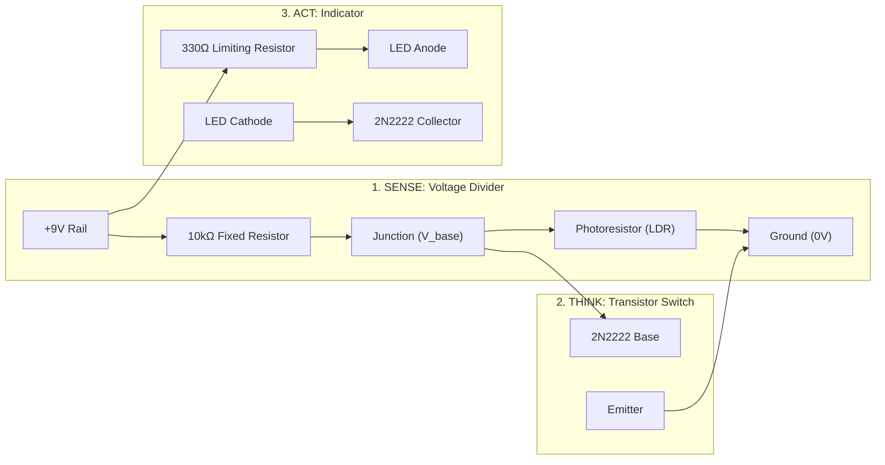

# 📓 Engineering Log: Lab 1 — Zero-Code Autonomous Nightlight

**Author**: [Your Full Name]  
**Date**: [YYYY-MM-DD]  
**Collaborators**: [Solo / Partner Name]  
**Milestone**: Unit 1 Capstone (Analog Electronics & Solid-State Logic)  
**Target Platform**: [Physical Breadboard / Tinkercad / In-Browser Simulator]  

---

## 1. Executive Objective & Sense-Think-Act Hypothesis

### Objective
Design, assemble, and test an autonomous analog sensory circuit that automatically illuminates an LED indicator in darkness and extinguishes it in ambient light, operating entirely via solid-state semiconductor physics without a microcontroller or lines of code.

### Sense-Think-Act Hypothesis
- **SENSE**: Ambient light photons modulate the resistance of a Cadmium Sulfide (CdS) photoresistor ($R_{\text{LDR}}$) configured in a voltage divider network with a $10\,\text{k}\Omega$ resistor.
- **THINK**: A 2N2222 NPN Bipolar Junction Transistor acts as an analog threshold switch. When base-to-emitter voltage $V_b \ge 0.70\,\text{V}$, base current forward-biases the PN junction and triggers collector-emitter saturation.
- **ACT**: The conducting transistor establishes a path to ground, illuminating the high-efficiency LED through a protective $330\,\Omega$ current-limiting resistor.
- **Hypothesis**: In total darkness ($R_{\text{LDR}} > 100\,\text{k}\Omega$), base voltage $V_b$ will exceed $0.70\,\text{V}$, snapping the transistor into saturation and driving between $15\,\text{mA}$ and $25\,\text{mA}$ through the LED. In bright sunlight ($R_{\text{LDR}} < 1\,\text{k}\Omega$), $V_b$ will drop below $0.50\,\text{V}$, holding the transistor in cutoff with zero visible LED emission.

---

## 2. Circuit Architecture & Schematic

---

## 3. Bill of Materials & Circuit Verification

| Component | Rating / Value | Role in Circuit | Status / Verified |
| :--- | :--- | :--- | :--- |
| **DC Power Supply** | 9.0V Battery or Bench Supply | Primary energy rail | [ ] Verified 9.0V $\pm 0.3\text{V}$ |
| **Photoresistor (LDR)** | $500\,\Omega$ (Light) to $200\,\text{k}\Omega$ (Dark) | Ambient light transducer | [ ] Resistance swings verified |
| **Fixed Resistor $R_1$** | $10\,\text{k}\Omega$ ($1/4\,\text{W}$) | Pull-up leg of voltage divider | [ ] Measured with multimeter |
| **Protective Resistor $R_2$** | $330\,\Omega$ ($1/4\,\text{W}$) | Prevents LED thermal destruction | [ ] Verified before applying power |
| **NPN Transistor** | 2N2222 or PN2222 | Solid-state threshold comparator | [ ] E-B-C pinout confirmed |
| **Light Emitting Diode** | Standard 5mm LED ($V_f \approx 2.0\text{V}$) | Actuator / Optical nightlight | [ ] Polarity confirmed (Anode long) |

---

## 4. Empirical Multimeter Measurements & Test Results

Record your actual bench or simulator readings below:

| Condition | Ambient Light Level (Lux) | Sensor Resistance ($R_{\text{LDR}}$) | Transistor Base Voltage ($V_b$) | Transistor State | LED Current ($I_{\text{LED}}$) | LED State |
| :--- | :--- | :--- | :--- | :--- | :--- | :--- |
| **Bright Sunlight / Direct Flashlight** | ~1000 Lux | [Record $\Omega$] | [Record V] | Cutoff (<0.7V) | [Record mA] | OFF (0 mA) |
| **Normal Ambient Room Light** | ~300 Lux | [Record $\Omega$] | [Record V] | Active / Threshold | [Record mA] | OFF / Faint |
| **Covered Hand / Dim Twilight** | ~50 Lux | [Record $\Omega$] | [Record V] | Partial Saturation | [Record mA] | Illuminating |
| **Total Darkness (Black Box)** | < 5 Lux | [Record $\Omega$] | [Record V] | Saturation ($\ge 0.7\text{V}$) | [Record mA] | Fully ON |

### Current Limiting Math Verification:
$$I_{\text{LED}} = \frac{V_{\text{CC}} - V_{\text{LED}} - V_{\text{CE(sat)}}}{R_2} = \frac{9.0\,\text{V} - 2.0\,\text{V} - 0.2\,\text{V}}{330\,\Omega} = \frac{6.8\,\text{V}}{330\,\Omega} \approx 20.6\,\text{mA}$$
- **Measured Current**: `[Enter your measured mA]` (Safe operating window: $15\,\text{mA} - 25\,\text{mA}$)

---

## 5. Troubleshooting & Root Cause Analysis

> Record at least one wiring or component challenge encountered during the lab and how you resolved it.

- **Symptom Observed**: [e.g., LED remained permanently on regardless of light level / LED did not illuminate in the dark]
- **Diagnostic Step**: [e.g., Checked voltage divider junction with DMM; measured 8.8V at base under all conditions]
- **Root Cause**: [e.g., Photoresistor ground leg was plugged into breadboard column 17 instead of ground column 16, leaving circuit open]
- **Resolution**: [e.g., Re-seated ground jumper wire into Row 16; base voltage dropped to 0.35V under room light; switching verified]

---

## 6. Engineering Reflection & Sense-Think-Act Principles

1. **Why is a transistor considered an autonomous robotic switch?**
   [Explain how the physical properties of the PN junction execute decision-making without software.]

2. **What would happen if the $10\,\text{k}\Omega$ resistor was replaced with a $100\,\Omega$ resistor?**
   [Analyze the impact on base current, battery drain, and switching sensitivity.]

3. **How does this relate to future digital microcontrollers (like Raspberry Pi Pico in Unit 2)?**
   [Explain how software GPIO pins will replace analog divider thresholds with ADC sampling and programmable logic.]

---

## 7. Self-Assessment Rubric Checklist

- [ ] **Circuit Integrity**: Breadboard matches schematic with zero loose contacts.
- [ ] **Current Protection**: $330\,\Omega$ resistor is verified in series with LED.
- [ ] **Multimeter Readings**: All 4 ambient conditions measured and recorded in Section 4.
- [ ] **Ohm's Law Calculation**: LED current calculated and verified within safe limits ($<25\,\text{mA}$).
- [ ] **Root Cause Documented**: Real troubleshooting scenario explained in Section 5.
- [ ] **Reflection Answered**: All 3 reflection questions answered in Section 6.
- [ ] **Git Committed**: Pushed to repository: `git commit -m "docs: complete Lab 1 nightlight log"`.
