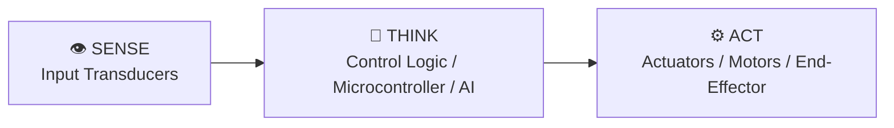

# 📓 Engineering Log: Lab 6 — Autonomous Maze-Navigating Mobile Robot in Webots

**Author**: [Your Full Name]  
**Date**: [YYYY-MM-DD]  
**Collaborators**: [Solo / Partner Name]  
**Milestone**: Unit 6: Movement & Mobile Robotics: Driving the Physical World  
**Target Platform**: [Webots 3D Physics Simulator (e-puck / TurtleBot / Pioneer)]  

---

## 1. Executive Objective & Sense-Think-Act Hypothesis

### Objective
Develop a closed-loop Proportional-Integral-Derivative (PID) wall-following controller and wheel odometry dead-reckoning system that navigates a mobile robot through an unknown maze without wall collisions.

### Sense-Think-Act Hypothesis
- **SENSE**: Time-of-flight distance sensors measure lateral wall distance $d_{\text{meas}}$ and forward obstacle clearances.
- **THINK**: PID controller computes steering correction $u(t) = K_p e(t) + K_i \int e(\tau)d\tau + K_d \frac{de(t)}{dt}$ where error $e(t) = d_{\text{target}} - d_{\text{meas}}$.
- **ACT**: Differential drive wheel motors adjust left/right velocities $\omega_L, \omega_R$ to smoothly maintain setpoint distance.
- **Hypothesis**: Adding derivative damping ($K_d > 0$) will eliminate the oscillatory 'snaking' instability observed in pure proportional control ($K_p$), reducing maximum lateral distance error by $>70\%$ through 90° corners.

---

## 2. System Architecture & Schematic



> Attach an ASCII schematic, pinout diagram, or photograph/screenshot of your build or simulation below:
> *(Optional: Save images in `notebooks/media/` and reference them here)*

---

## 3. Bill of Materials & Subsystem Verification

| Component / Subsystem | Part Number / Specs | Quantity | Interface / GPIO Pin | Power Supply Rail |
| :--- | :--- | :--- | :--- | :--- |
| **Simulation Environment** | Webots Open-Source 3D Robot Simulator | 1 | Desktop / Laptop | Virtual 3D Physics Engine |
| **Robot Model** | e-puck or TurtleBot3 Burger | 1 | Differential Drive Kinematics | Virtual Robot Node |
| **Sensory Array** | 8x Infrared Distance Sensors (ToF) | 8 | Internal Webots Devices | Virtual Ray-Tracing |
| **Controller Script** | Python Controller (`maze_runner.py`) | 1 | Webots Robot API | Closed-Loop Control |

---

## 4. Empirical Data & Test Results

Record your actual bench or simulator readings below:

| Tuning Iteration | Kp Gain | Ki Gain | Kd Gain | Average Wall Offset Error | Max Corner Overshoot | Maze Lap Completion Time |
| :--- | :--- | :--- | :--- | :--- | :--- | :--- |
| Run 1: P-Only Control | 2.5 | 0.0 | 0.0 | 4.2 cm | 8.5 cm (Crashed into corner!) | DNF (Crash) |
| Run 2: Increased P Gain | 4.0 | 0.0 | 0.0 | 3.1 cm | Oscillated violently into wall | DNF (Oscillation) |
| Run 3: PD Control | 3.0 | 0.0 | 1.8 | 1.2 cm | 2.1 cm (Smooth cornering) | 48.2 seconds |
| Run 4: Tuned PID Control | 3.2 | 0.05 | 2.0 | 0.4 cm | 1.1 cm (Zero steady-state drift) | 41.6 seconds (Optimal) |

---

## 5. Troubleshooting & Root Cause Analysis

> Record at least one wiring, logic, or algorithmic challenge encountered during this lab and how you resolved it.

- **Symptom Observed**: [e.g., Target behavior failed, motor jittered, sensor returned NaN, communication timed out]
- **Diagnostic Step**: [e.g., Checked oscilloscope trace, printed debug telemetry, verified voltage levels with multimeter]
- **Root Cause**: [e.g., Timing latency in control loop, loose jumper wire, noisy ground plane, misconfigured baud rate]
- **Resolution**: [e.g., Added decoupling capacitor, modified PID derivative filter, corrected pin mapping in firmware]

---

## 6. Code & Firmware Implementation

```python
# Insert your primary control loop, state machine, or firmware snippet here:
def run_autonomous_loop():
    pass
```
- **Firmware Commit Hash**: `[Optional: git rev-parse --short HEAD]`

---

## 7. Engineering Reflection & Future Iterations

1. **What causes integral windup when a mobile robot gets stuck against an immovable obstacle, and how do you prevent it in code?**
   [Answer in 2-4 sentences based on your experimental observations.]

2. **Why does dead-reckoning odometry drift over time, even with high-resolution optical wheel encoders?**
   [Answer in 2-4 sentences based on your experimental observations.]

3. **Explain the difference between differential drive kinematics (tank steering) and Ackermann steering (car steering).**
   [Answer in 2-4 sentences based on your experimental observations.]

---

## 8. Self-Assessment Rubric Checklist

- [ ] **Objective & Hypothesis**: Clearly formulated with measurable success criteria.
- [ ] **System Architecture**: Complete schematic and pinout documented.
- [ ] **Empirical Data Recorded**: Real test measurements entered in Section 4 data table.
- [ ] **Root Cause Analysis**: At least one diagnostic failure and fix explained in Section 5.
- [ ] **Code Implementation**: Functional firmware snippet included in Section 6.
- [ ] **Reflection Questions Answered**: All 3 reflection prompts thoroughly analyzed.
- [ ] **Version Control**: Log committed to Git repository with a descriptive message.
