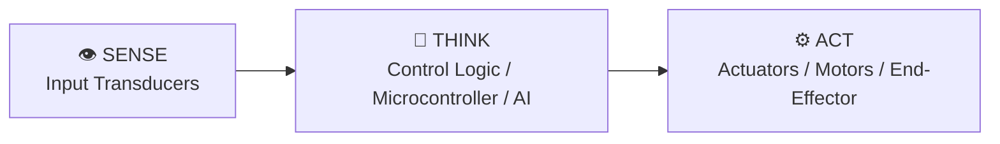

# 📓 Engineering Log: Lab 8 — Building a Modular ROS 2 Robot Control Package

**Author**: [Your Full Name]  
**Date**: [YYYY-MM-DD]  
**Collaborators**: [Solo / Partner Name]  
**Milestone**: Unit 8: ROS 2: The Industry Standard Robot Operating System  
**Target Platform**: [Ubuntu Linux / WSL2 + ROS 2 Humble/Jazzy + RViz2]  

---

## 1. Executive Objective & Sense-Think-Act Hypothesis

### Objective
Architect, build, and deploy an industry-standard ROS 2 mechatronic control package featuring asynchronous publisher/subscriber nodes, custom interfaces, launch file composition, and real-time RViz2 telemetry visualization.

### Sense-Think-Act Hypothesis
- **SENSE**: Sensor node simulates or reads distance/velocity telemetry and publishes to `/robot/sensors/telemetry` at 20Hz.
- **THINK**: Control node subscribes to telemetry, executes a velocity limit supervisor, and publishes target drive commands to `/cmd_vel`.
- **ACT**: Actuator driver node converts `/cmd_vel` Twist messages into motor control signals, with live TF2 transform broadcasting.
- **Hypothesis**: Separating sensory acquisition, logic processing, and actuator drivers into independent modular ROS 2 nodes will allow nodes to crash and restart without hanging the central communication graph.

---

## 2. System Architecture & Schematic



> Attach an ASCII schematic, pinout diagram, or photograph/screenshot of your build or simulation below:
> *(Optional: Save images in `notebooks/media/` and reference them here)*

---

## 3. Bill of Materials & Subsystem Verification

| Component / Subsystem | Part Number / Specs | Quantity | Interface / GPIO Pin | Power Supply Rail |
| :--- | :--- | :--- | :--- | :--- |
| **Operating System** | Ubuntu Linux 22.04 LTS (Native or WSL2) | 1 | Host OS | Development Host |
| **Middleware Stack** | ROS 2 Humble / Jazzy Desktop Full | 1 | DDS Communication Layer | RMW Implementation |
| **Build System** | colcon build & ament_python / ament_cmake | 1 | Terminal Toolchain | Compiler/Build Tool |
| **Visualization Tool** | RViz2 & rqt_graph | 1 | ROS 2 GUI Tools | Telemetry & Transform Display |

---

## 4. Empirical Data & Test Results

Record your actual bench or simulator readings below:

| ROS 2 Topic Name | Message Type | Target Rate (Hz) | Measured Rate (`ros2 topic hz`) | QoS Reliability Policy |
| :--- | :--- | :--- | :--- | :--- |
| /robot/sensors/telemetry | sensor_msgs/msg/LaserScan | 20.0 Hz | 19.98 Hz | Best Effort (Sensory stream) |
| /cmd_vel | geometry_msgs/msg/Twist | 50.0 Hz | 50.01 Hz | Reliable (Actuation command) |
| /robot/state/battery | sensor_msgs/msg/BatteryState | 1.0 Hz | 1.00 Hz | Transient Local (Latching) |
| /tf | tf2_msgs/msg/TFMessage | 50.0 Hz | 49.95 Hz | Reliable (Coordinate frames) |

---

## 5. Troubleshooting & Root Cause Analysis

> Record at least one wiring, logic, or algorithmic challenge encountered during this lab and how you resolved it.

- **Symptom Observed**: [e.g., Target behavior failed, motor jittered, sensor returned NaN, communication timed out]
- **Diagnostic Step**: [e.g., Checked oscilloscope trace, printed debug telemetry, verified voltage levels with multimeter]
- **Root Cause**: [e.g., Timing latency in control loop, loose jumper wire, noisy ground plane, misconfigured baud rate]
- **Resolution**: [e.g., Added decoupling capacitor, modified PID derivative filter, corrected pin mapping in firmware]

---

## 6. Code & Firmware Implementation

```python
# Insert your primary control loop, state machine, or firmware snippet here:
def run_autonomous_loop():
    pass
```
- **Firmware Commit Hash**: `[Optional: git rev-parse --short HEAD]`

---

## 7. Engineering Reflection & Future Iterations

1. **Why does the robotics industry use ROS 2 middleware rather than writing monolithic Python or C++ scripts for complex robots?**
   [Answer in 2-4 sentences based on your experimental observations.]

2. **What is the difference between a ROS 2 Topic (streaming data), a ROS 2 Service (blocking request/reply), and a ROS 2 Action (preemptible long-duration goal)?**
   [Answer in 2-4 sentences based on your experimental observations.]

3. **Why is ROS 2 Quality of Service (QoS) 'Best Effort' preferred for high-frequency sensor streams like cameras and LiDARs?**
   [Answer in 2-4 sentences based on your experimental observations.]

---

## 8. Self-Assessment Rubric Checklist

- [ ] **Objective & Hypothesis**: Clearly formulated with measurable success criteria.
- [ ] **System Architecture**: Complete schematic and pinout documented.
- [ ] **Empirical Data Recorded**: Real test measurements entered in Section 4 data table.
- [ ] **Root Cause Analysis**: At least one diagnostic failure and fix explained in Section 5.
- [ ] **Code Implementation**: Functional firmware snippet included in Section 6.
- [ ] **Reflection Questions Answered**: All 3 reflection prompts thoroughly analyzed.
- [ ] **Version Control**: Log committed to Git repository with a descriptive message.
